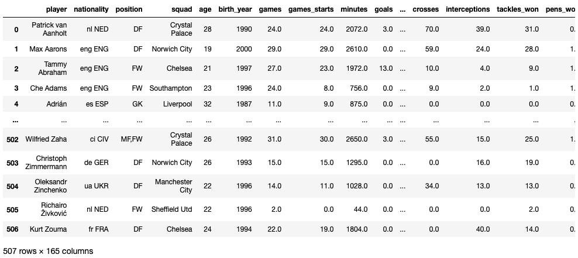

# Scrape FBref data

This repository is to scrape football data from fbref.com which is provided by StatsBomb - 
specially the recently added extensive data of the top five leagues. A lot of the intrinsic scraping code has been taken from this repository: https://github.com/chmartin/FBref_EPL

This snapshot from fbref.com indicates the recently added stats I'm talking about. You can scrape all of them from the Jupyter notebook in no time. Team and keeper stats are also included. 

**This dataframe snapshot is what you'll end up with. You can do stuff on it in Python, or save it onto your desktop for visualisations with Tableau or R.**

**The order of the columns is like it is on fbref - so standard stats first, then shooting, passing etc. and miscellaneous at the end. Check the fbref glossary for any confusion about the same. The scraper won't work for those leagues which have other columns compared to the top 5 leagues. Do reach out to me on Twitter if there's any problem!**